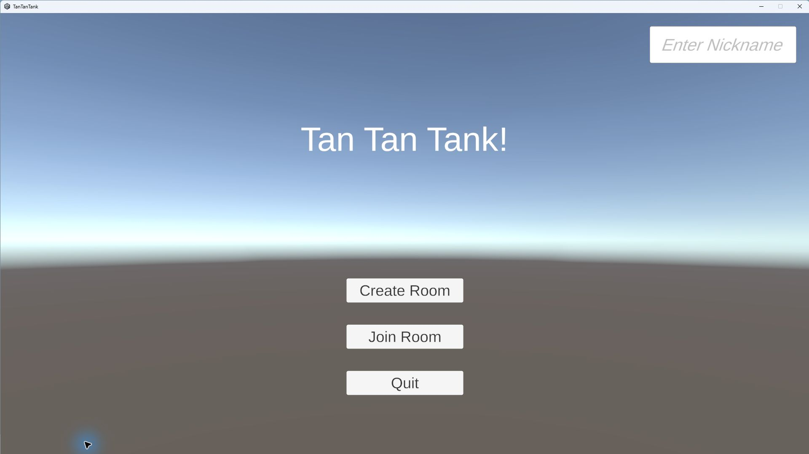
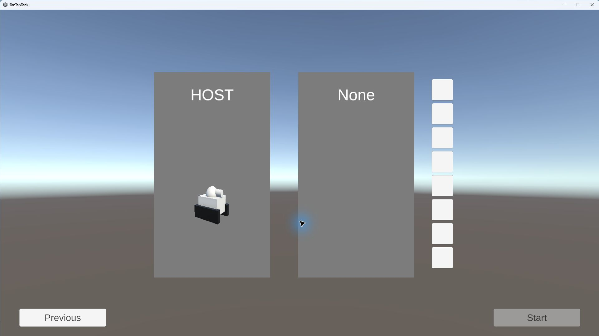
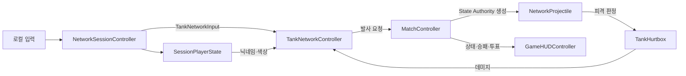

# TanTanTank

방 코드로 접속해 벽에 튕기는 포탄으로 승부하는 2인 온라인 탱크 게임입니다.

짧은 대전 안에서도 조준 각도, 반사 경로, 발사 타이밍을 계속 고민하게 만드는 것을 목표로 만들었습니다.

  
  

## 프로젝트 개요

| 항목 | 내용 |
| --- | --- |
| 개발 형태 | 1인 개발 |
| 개발 기간 | 2026.08.29 - 2026.09.09 |
| 플랫폼 | Windows |
| 엔진 | Unity 6.3 (6000.3.16f1) |
| 언어 | C# |
| 네트워크 | Photon Fusion |
| 렌더링 | Universal Render Pipeline |

## 핵심 플레이

- 6자리 방 코드를 이용한 2인 매치 생성 및 참가
- 닉네임 입력과 8종 탱크 컬러 선택
- `WASD` 이동, 마우스 조준, 마우스 왼쪽 버튼 발사
- 벽 반사 경로를 미리 보여 주는 조준선
- HP 3, 발사 쿨다운 1초, 3점 선취 라운드제
- 라운드 종료 후 두 플레이어가 모두 동의하면 다음 맵으로 전환
- 같은 틱에 서로를 처치했을 때 무승부로 처리

## 구현에서 집중한 부분

### 서버 권한 기반의 일관된 판정

이동 입력과 조준 방향은 각 클라이언트가 보내지만, 발사·피격·점수·라운드 전환은 `State Authority`가 확정하도록 분리했습니다. 닉네임과 색상 변경도 RPC로 권한 주체에 전달해 두 화면에서 같은 결과를 보도록 구성했습니다.

매치 진행은 `Loading → RoundActive → RoundResult → ChangingWorld → MatchResult` 상태로 관리합니다. 승패가 결정된 뒤에는 남아 있는 포탄을 정리하고, 다음 라운드 투표와 맵 교체를 같은 상태 흐름 안에서 처리합니다.

### 예측선과 실제 포탄의 궤적 일치

조준선과 포탄이 서로 다른 계산을 사용하면 플레이어가 본 경로와 실제 결과가 어긋납니다. 두 기능 모두 동일한 방향 정규화·반사 규칙을 사용하고, 포탄 반지름을 반영한 `SphereCastNonAlloc`으로 가장 가까운 충돌을 찾도록 만들었습니다.

한 네트워크 틱 안에 여러 번 반사될 수 있으므로 남은 이동 거리를 소진하는 방식으로 반복 계산합니다. 발사 직후에는 소유자 충돌을 잠시 제외하고, 탱크의 Hurtbox를 완전히 빠져나온 뒤부터 자해 판정을 허용했습니다.

### 클라이언트 지터와 프레임 드랍 개선

초기 구현 이후 실제 멀티클라이언트 환경에서 발생한 두 가지 문제를 [프레임 드랍 수정](https://github.com/keastmin/TanTanTank/commit/9c32db24fdcb6dfe833168e68565930001fcadde), [이동 지터 수정](https://github.com/keastmin/TanTanTank/commit/5b5caef0b61f702a1add87d5bf8a10a13597227d) 커밋으로 나눠 추적했습니다.

- Rigidbody 직접 이동을 Fusion `NetworkCharacterController` 기반 이동으로 교체해 예측과 보간 경로를 일치시켰습니다.
- 입력 소유자가 카메라 기준 이동 방향을 월드 좌표로 변환해 전송하도록 바꿔, 서버와 클라이언트의 카메라 차이가 이동에 섞이지 않게 했습니다.
- 네트워크 입력 폴링마다 반복하던 마우스 Ray 계산을 렌더 프레임당 한 번으로 줄이고 결과를 재사용했습니다.
- 조준선 갱신을 최대 30Hz로 제한하고 위치와 방향이 바뀌지 않은 프레임은 건너뜁니다.
- HUD의 계층 탐색 결과를 캐시하고 HP·점수·닉네임이 달라질 때만 UI 값을 갱신합니다.
- 충돌 검사 배열과 경로 포인트 리스트를 재사용해 전투 중 불필요한 할당을 줄였습니다.

## 구조

| 영역 | 역할 |
| --- | --- |
| `NetworkSessionController` | 방 생성/참가, 플레이어 입퇴장, 입력 수집, 씬 전환 |
| `SessionPlayerState` | 플레이어별 닉네임·색상·슬롯 동기화 |
| `MatchController` | 라운드 상태, 스폰, 승패, 점수, 다음 스테이지 투표 |
| `TankNetworkController` | 이동, 조준, 발사 쿨다운, HP와 점수 |
| `NetworkProjectile` | 연속 충돌 검사, 벽 반사, 소유자 예외, 피격 처리 |
| `AimPrediction` | 실제 포탄 규칙을 이용한 반사 경로 미리보기 |

## 프리빌드 중심 개발 과정

기능을 바로 늘리기보다 먼저 **2인 접속 → 준비 → 전투 → 라운드 정산 → 재시작**으로 플레이 루프를 고정했습니다. 그다음 네트워크 데이터마다 누가 입력하고 누가 최종 판정하는지 정리한 뒤 구현해, 중간에 구조를 다시 뜯는 일을 줄였습니다.

반복 설정은 [`TanTanTankProjectSetup.cs`](./Assets/Editor/TanTanTankProjectSetup.cs)에 모았습니다. 메뉴 한 번으로 레이어, 밸런스 데이터, 네트워크 프리팹, UI 참조, 씬 구성을 다시 맞출 수 있습니다. 수작업 설정 누락을 막고 같은 조건에서 빠르게 재검증하기 위한 도구입니다.

검증은 ParrelSync로 에디터 클라이언트를 나누고 Windows 빌드를 함께 실행하는 방식으로 진행했습니다. 기능 단위로 범위를 잘라 확인하고, 실제 플레이에서 확인된 병목만 측정 지점에 맞춰 수정했습니다. 이 방식으로 불필요한 반복 작업과 리소스 사용을 줄이면서 핵심 플레이 완성도에 시간을 집중했습니다.

## 실행 방법

1. Unity Hub에서 `6000.3.16f1` 버전으로 프로젝트를 엽니다.
2. Photon Dashboard에서 Fusion App을 만든 뒤 Fusion 설정에 App ID를 입력합니다.
3. Unity 메뉴에서 `TanTanTank > Configure Project`를 실행합니다.
4. `Assets/Scenes/MainScene.unity`를 열어 Play하거나 Windows 빌드를 생성합니다.
5. 두 클라이언트 중 하나가 방을 만들고, 다른 클라이언트가 표시된 6자리 코드로 참가합니다.

로컬 멀티플레이 테스트에는 프로젝트에 포함된 ParrelSync를 사용할 수 있습니다.

## 주요 코드

- [네트워크 세션 및 입력](./Assets/Scripts/TanTanTank/Network/NetworkSessionController.cs)
- [매치 상태와 라운드 진행](./Assets/Scripts/TanTanTank/Match/MatchController.cs)
- [탱크 이동 및 전투](./Assets/Scripts/TanTanTank/Tank/TankNetworkController.cs)
- [포탄 충돌과 반사](./Assets/Scripts/TanTanTank/Projectile/NetworkProjectile.cs)
- [반사 경로 예측](./Assets/Scripts/TanTanTank/Tank/AimPrediction.cs)
- [밸런스 설정](./Assets/Scripts/TanTanTank/Config/GameBalanceConfig.cs)

## 라이선스

이 프로젝트는 [MIT License](./LICENSE)를 따릅니다.
